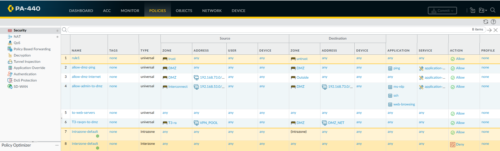

# Enterprise Network Security Architecture & Automation

## Network Architecture Diagram

## Firewall Policy Enforcement (Palo Alto NGFW)

Configured zone-based firewall policies to allow required DMZ services while explicitly denying inter-zone access to the Secure zone.
